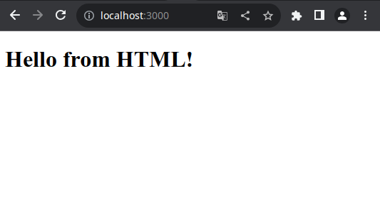

# dnjs (Docker Nodejs)

La base docker pour un projet en nodejs. Contient une base d'un serveur nodejs.

<details>
  <summary>Table des matières</summary>
  <ol>
    <li>
        <a href="#création-du-conteneur-docker">Création du conteneur (Docker)</a>
        <ul>
            <li><a href="#le-fichier-env">Le fichier .env</a></li>
            <li><a href="#modifier-l-adresse-de-port">Modifier l'adresse de port</a></li>
            <li><a href="#installer-le-conteneur">Installer le conteneur</a></li>
        </ul>
    </li>
    <li><a href="#rechercher-un-package-docker">Rechercher un package (Docker)</a></li>
    <li>
        <a href="#install-un-package-docker">Install un package (Docker)</a>
        <ul>
            <li><a href="#le-fichier-env">Le fichier .env</a></li>
            <li><a href="#dans-dockerfile">Dans Dockerfile</a></li>
        </ul>
    </li>
    <li><a href="#le-dossier-du-projet">Le dossier du projet</a></li>
    <li><a href="#mini-projet-nodejs">Mini projet nodejs</a></li>
  </ol>
</details>

## Création du conteneur (Docker)
Vous devez avoir installé Docker.
Pour la création du conteneur docker pour le projet.
### Le fichier .env
Modifier le contenu du fichier .env.example :
```
NAME_PROJECT=dnjs
NAME_NODEJS_CONTAINER=dnjs_httpd
NAME_SGBD_CONTAINER=dnjs_mongo
VALUE_NODEJS_PORT=3000
VALUE_SGBD_PORT=27020
```
Par le nom de votre projet, par exemple 'nameProject' :
```
NAME_PROJECT=nameProject
NAME_NODEJS_CONTAINER=nameProject_httpd
NAME_SGBD_CONTAINER=nameProject_mongo
VALUE_NODEJS_PORT=3000
VALUE_SGBD_PORT=27020
```
Créé un fichier "**.env**" à partir du fichier "**.env.example**" (copier/coller). <br />
> [!WARNING]
> Attention de conserver le fichier "**.env.example**".

### Modifier l'adresse de port
Si vous avez besoin de modifier le port, merci de le faire dans le fichier "**.env**".<br />
> [!WARNING]
> ne surtout pas le faire dans le fichier "**.env.example**".<br />

Un port de votre pc peut être utilisé par un autre projet, il faudra donc modifier celui-ci. Ce qui est vrai sur un pc, ne le sera pas sur les autres, donc on ne modifit pas les valeurs dans le fichier "**.env.example**".
Il est préférable d'incrémenter à l'identique les ports du projet.
Je dois incrémenter de 9 un des ports, je le fais aussi pour les autres. Ceci évite de se perdre dans les ports disponibles.
Exemple :
```
VALUE_NODEJS_PORT=3009
VALUE_SGBD_PORT=27029
```

### Installer le conteneur
Vous pouvez créer votre conteneur.
```
$ ./install.sh
```

## Rechercher un package (Docker)
Si vous avez besoin d'un package pour votre projet dans le conteneur. Vous pouvez rechercher les packages disponibles pour le conteneur.
```
$ ./bin/terminal.sh
# apt-cache search name_package
```

## Install un package (Docker)
Si vous avez besoin d'installer un package dans votre conteneur.
```
$ ./bin/terminal.sh
# apt install name_package
```

### Dans Dockerfile
Quand vous installez un package, vous devez aussi le rajouter dans le fichier "**.docker/linux_agcc/Dockerfile**", pour le conserver. Vous devez ajouter la ligne suivante à la fin du fichier avec le bon nom de package.
```
RUN apt install name_package
```

## Le dossier du projet
Votre code devra être placé dans le dossier "**project**".

## Mini-projet nodejs
Il y a un mini-projet Nodejs pour vous montrer un exemple, mais vous pouvez le retirer en vidant le dossier "**project**".
Lors de l'installation, il démarre le serveur Nodejs sur le mini-projet :<br />

<br />vous pouvez le modifier dans le fichier "**install.sh**" :
```
./bin/pm2.sh start server.js --watch --merge-logs --log-date-format="YYYY-MM-DD HH:mm Z"
```
