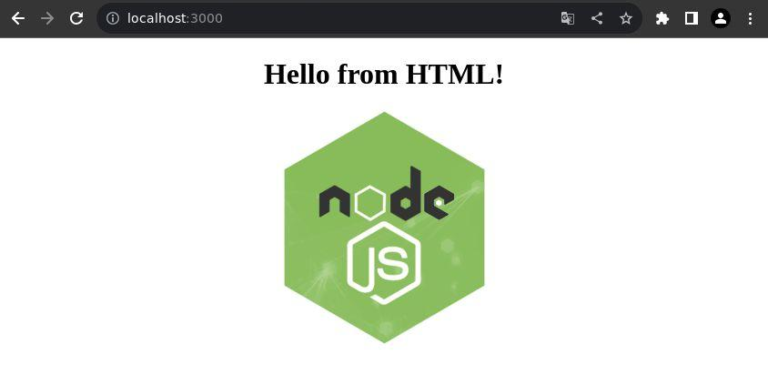
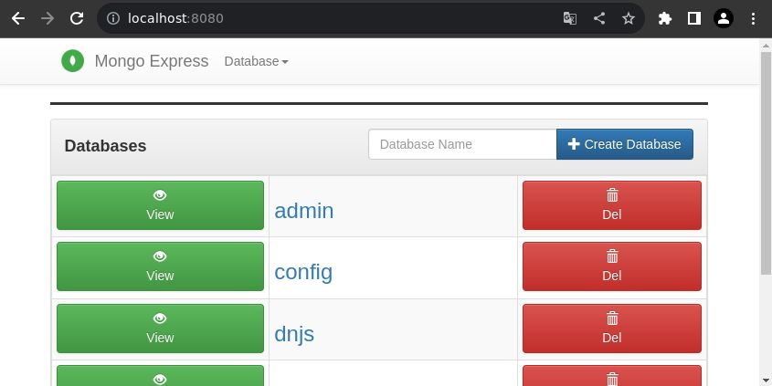
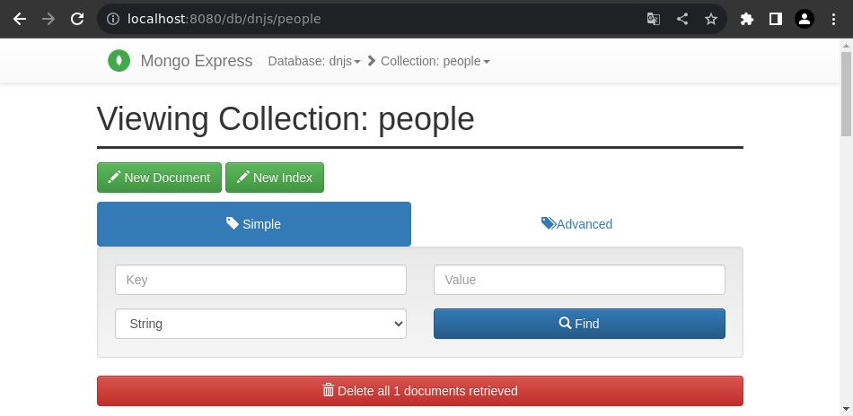
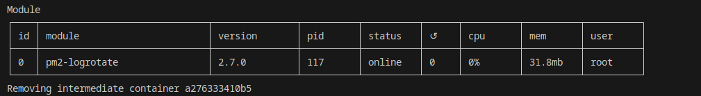

# donomo (DOcker NOdejs MOngodb)
V1.0.0

<details>
  <summary>Table des matières</summary>
  <ol>
    <li>
        <a href="#présentation">Présentation</a>
        <ul>
            <li><a href="#l-avantage-d-utiliser-docker">L'avantage d'utiliser docker</a></li>
            <li><a href="#conteneur-nodeJS">Conteneur nodeJS</a></li>
            <li><a href="#conteneur-mailhog">Conteneur mailhog</a></li>
            <li><a href="#conteneur-mongo-express">Conteneur mongo-express</a></li>
            <li><a href="#conteneur-mongo">Conteneur mongo</a></li>
            <li><a href="#conteneurs-sgbd">Conteneurs SGBD</a></li>
        </ul>
    </li>
    <li>
        <a href="#création-du-conteneur-docker">Création du conteneur (Docker)</a>
        <ul>
            <li><a href="#le-fichier-env">Le fichier .env</a></li>
            <li><a href="#modifier-l-adresse-de-port">Modifier l'adresse de port</a></li>
            <li><a href="#installer-le-conteneur">Installer le conteneur</a></li>
            <li><a href="#modifier-le-fichier-d-installation">Modifier le fichier d'installation</a></li>
            <li><a href="#modifier-les-versions">Modifier les versions</a></li>
        </ul>
    </li>
    <li><a href="#rechercher-un-package-docker">Rechercher un package (Docker)</a></li>
    <li>
        <a href="#install-un-package-docker">Install un package (Docker)</a>
        <ul>
            <li><a href="#le-fichier-env">Le fichier .env</a></li>
            <li><a href="#dans-dockerfile">Dans Dockerfile</a></li>
        </ul>
    </li>
    <li><a href="#logs-et-info-conteneur-docker">Logs et info conteneur (Docker)</a></li>
    <li><a href="#le-dossier-du-projet">Le dossier du projet</a></li>
    <li>
        <a href="#mini-projet-nodejs">Mini projet nodejs</a>
        <ul>
            <li><a href="#packages-installés-dans-le-mini-projet">Packages installés dans le mini-projet</a></li>
        </ul>
    </li>
    <li><a href="#les-commandes-nodejs-dans-le-mini-projet">Les commandes nodejs dans le mini-projet</a></li>
    <li><a href="#visualiser-les-messages-de-la-console-ou-les-logs">Visualiser les messages de la console ou les logs</a></li>
    <li><a href="#server-start-stop-restart">Server start|stop|restart</a></li>
  </ol>
</details>

## Présentation
La base docker pour un projet en nodeJS. Ceci est une base, vous pouvez le modifier selon vos besoins.<br />
> [!WARNING]
> Vous devez installer docker pour pouvoir l'utiliser.

### L'avantage d'utiliser docker
Lorsque vos faites un projet avec docker vous devez transmettre la totalité du projet, les fichiers de création des conteneurs et le code. Pour ce projet, vous devez transmettre le contenu en totalité du dossier "**donomo**" (**que vous pouvez et surtout devez le renommer au nom de votre projet**) dans un git.<br />
Les avantages :<br />
* Pas de programme à installer sur votre pc (à part docker et un éditeur ou IDE)
* Travailler à plusieurs avec les mêmes conteneurs à l'identique
* Prêt à travailler directement sur le code après la création des conteneurs
* Avoir une base prés remplie lors de la création des conteneurs.<sup>(1)</sup>
<br /> Après installation des conteneurs, on peut directement continuer le code.
<sup>(1) [Conteneur mongo](#conteneur-mongo)</sup>

### Conteneur nodeJS
Il est conçu à partir de l'image du [docker nodeJS](https://hub.docker.com/_/node/).<br />
Il contiendra vos codes.<br />
Il installe aussi dans le conteneur :<br />
* [pm2](https://pm2.keymetrics.io/)
* [pm2-logrotate](https://www.npmjs.com/package/pm2-logrotate)

<br /> 
C'est dans ce conteneur que vous allez placer vos codes nodeJS, dans le dossier "**project**" (qui est lié au conteneur).
<br /><br />

### Conteneur mailhog
Il est conçu à partir de l'image du [docker mailhog](https://hub.docker.com/r/mailhog/mailhog/).<br />
Ce conteneur va vous permettre de visualiser les emails transmis par votre projet nodeJS.
<br /><br />

### Conteneur mongo-express
Il est conçu à partir de l'image du [docker mongo-express](https://hub.docker.com/r/mailhog/mailhog/).<br />
Ce conteneur va vous permettre de visualiser votre base de données mongodb (NOSQL).
<br /><br />

### Conteneur mongo
Il est conçu à partir de l'image du [docker mongo](https://hub.docker.com/_/mongo).<br />
Ce conteneur contiendra votre base de donnée. Il est possible de visualiser son contenu à partir du [conteneur mongo-express](#conteneur-mongo-express)<br />
Il est possible d'entrer des tables lors de sa création, pour se faire il faudra récupérer les tables sous format json et les placer dans un dossier et modifier le fichier "**docker-compose.yml**".<br />
J'ai mis en place un exemple avec la table people "**people.json**" :
```
# start data
- ./.docker/sgbd_data/people.json:/mongo-seed/people.json
# end data
```
<br /><br />

> [!NOTE]
> Vous pouvez changer de SGBD pour un SQL. Pour les projet en nodeJS on utilise principalement un SGBD NOSQL.

### Conteneurs SGBD
Ici je vais présenter quelques conteneurs SGBD et leurs visionneurs sous le format d'un tableau :

| SGBD | visionneur |
| ------------- | ------------- |
| [mariadb](https://hub.docker.com/_/mariadb) | [phpmyadmin](https://hub.docker.com/r/phpmyadmin/phpmyadmin/) |
| [mysql](https://hub.docker.com/_/mysql) | [phpmyadmin](https://hub.docker.com/r/phpmyadmin/phpmyadmin/) |
| [postgres](https://hub.docker.com/_/postgres) | [phppgadmin](https://hub.docker.com/r/dockage/phppgadmin) |
| [mongo](https://hub.docker.com/_/mongo) | [mongo-express](https://hub.docker.com/r/mailhog/mailhog/) |

Ceci est une petite partie des [SGBD](https://fr.wikipedia.org/wiki/Syst%C3%A8me_de_gestion_de_base_de_donn%C3%A9es), vous pouvez vérifier la disponibilité de votre SGBD dans [docker hub](https://hub.docker.com/).

## Création du conteneur (Docker)
Vous devez avoir installé Docker. 
Pour la création du conteneur docker pour le projet.
### Le fichier .env
Modifier le contenu du fichier "**.env.example**" :
```
NAME_PROJECT=donomo
NAME_NODEJS_CONTAINER=donomo_nodejs
NAME_SGBD_CONTAINER=donomo_mongo
NAME_MOEXPRESS_CONTAINER=donomo_moexpress
NAME_MAILHOG_CONTAINER=donomo_mailhog
```
Par le nom de votre projet, par exemple 'nameProject' :
```
NAME_PROJECT=nameProject
NAME_NODEJS_CONTAINER=nameProject_nodejs
NAME_SGBD_CONTAINER=nameProject_mongo
NAME_MOEXPRESS_CONTAINER=nameProject_moexpress
NAME_MAILHOG_CONTAINER=nameProject_mailhog
```
Créé un fichier "**.env**" à partir du fichier "**.env.example**" (copier/coller). <br />
> [!WARNING]
> Attention de conserver le fichier "**.env.example**".

### Modifier l'adresse de port
Si vous avez besoin de modifier le port, merci de le faire dans le fichier "**.env**".<br />
> [!WARNING]
> Ne surtout pas le faire dans le fichier "**.env.example**".

<br />Un port de votre pc peut être utilisé par un autre projet, il faudra donc modifier celui-ci. Ce qui est vrai sur un pc, ne le sera pas sur les autres, donc on ne modifit pas les valeurs dans le fichier "**.env.example**".<br />
Il est préférable d'incrémenter à l'identique les ports du projet.<br />
Je dois incrémenter de 9 un des ports, je le fais aussi pour les autres. Ceci évite de se perdre dans les ports disponibles.<br />
Exemple :<br />
```
VALUE_NODEJS_PORT=3009
VALUE_SGBD_PORT=27029
VALUE_MOEXPRESS_PORT=8089
VALUE_MAILHOG_DISPLAY_PORT=8029
```

### Installer le conteneur
Vous pouvez créer votre conteneur.
```
$ ./install.sh
```

### Modifier le fichier d'installation
Après l'installation, il faudra modifier le contenu du fichier "**install.sh**" :
```
./bin/createProject.sh
./bin/npm.sh install
./start.sh
```
Par :
```
#./bin/createProject.sh
./bin/npm.sh install
./start.sh
```
Si ce n'est pas déjà fait.

### Modifier les versions
> [!WARNING]
> Il est indispensable de le faire pour pouvoir utiliser un conteneur identique des années plus tard. Surtout pour le conteneur qui contient le code.

Sur le projet actuel, on utilise les nouvelles versions ce qui peut poser des problèmes sur le projet par la suite. Il est préférable d'utiliser la version utilisée lors de la création du projet.
<br />[docker nodejs](https://hub.docker.com/_/node/)
```
$ ./bin/terminal.sh
# nodejs -v
v20.6.1
```
Dans le fichier "**.docker/angular/Dockerfile**", remplacé '**latest**' par la bonne version disponible pour docker :
```
FROM node:latest
```
```
FROM node:20.6.1
```
Pour pm2 :
```
$ ./bin/terminal.sh
# pm2 --version
5.3.0
```
Dans le fichier "**.docker/angular/Dockerfile**", remplacé :
```
RUN npm install -y --no-install-recommends pm2 -g
```
```
RUN npm install -y --no-install-recommends pm2@5.3.0 -g
```
Pour pm2-logrotate :<br />
Au moment de l'installation :
<br /><br />
Dans le fichier "**.docker/angular/Dockerfile**", remplacé :
```
RUN pm2 install pm2-logrotate
```
```
RUN pm2 install pm2-logrotate@2.7.0
```

<br />

> [!NOTE]
> Vous n'êtes pas obligé de modifier la version des autres conteneurs.

<br />

Pour connaître la version pour mongodb :
```
$ ./bin/terminal_mongo.sh
# mongod --version
db version v7.0.1
```
Remplacer la version dans le fichier "**.env.example**" :
```
VALUE_SGBD_VERSION=7.0.1
VALUE_MOEXPRESS_VERSION=latest
VALUE_MAILHOG_VERSION=latest
```


## Rechercher un package (Docker)
Si vous avez besoin d'un package pour votre projet dans le conteneur. Vous pouvez rechercher les packages disponibles pour le conteneur.
```
$ ./bin/terminal.sh
# apt-cache search name_package
```

## Install un package (Docker)
Si vous avez besoin d'installer un package dans votre conteneur.
```
$ ./bin/terminal.sh
# apt install name_package
```

## Logs et info conteneur (Docker)
Vous pouvez avoir besoin de visualiser les logs d'un conteneur si celui-ci ne démarre pas, pour trouver le problème par exemple. Pour ce faire :
```
$ ./bin/container_logs.sh
Options:
   --nodejs
   --mongo
   --mongo-express
   --mailhog
   --helps
   [id ou nom du conteneur]
$ ./bin/container_logs.sh --nodejs
```
Vous pouvez avoir besoin d'information sur l'un des conteneurs, pour trouver sa version par exemple. Pour ce faire :
```
$ ./bin/container_info.sh 
Options:
   --nodejs
   --mongo
   --mongo-express
   --mailhog
   --helps
   [id ou nom du conteneur]
$ ./bin/container_info.sh --mailhog
```
<br />
> [!WARNING]
> Il contient beaucoup d'information sous un format json et ce n'est pas facile de le lire sur le terminal, il est préférable de le mettre dans un fichier json.
<br />
Pour mettre les informations dans un fichier json :
```
$ ./bin/container_info.sh --mailhog >> mailhog_info.json
```

### Dans Dockerfile
Quand vous installez un package, vous devez aussi le rajouter dans le fichier "**.docker/linux_agcc/Dockerfile**", pour le conserver. Vous devez ajouter la ligne suivante à la fin du fichier avec le bon nom de package.
```
RUN apt install name_package
```

## Le dossier du projet
Votre code devra être placé dans le dossier "**project**".

## Mini-projet nodejs
Il y a un mini-projet Nodejs pour vous montrer un exemple, mais vous pouvez le retirer en vidant le dossier "**project**".<br />
Lors de l'installation, il démarre le serveur Nodejs du mini-projet sur '**localhost:3000**' si vous n'avez pas modifié le port (sinon il faut modifier le numéro de port du lien) :<br />

<br />Vous pouvez modifier le démarrage de votre projet dans le fichier "**.env.example**" et aussi dans le fichier "**.env**" :
```
NAME_JS_SERVER=server.js
```
Quand vous allez redémarrer le pc, il faudra relancer le serveur Nodejs avec la commande :
```
$ ./start.sh
```

### Packages installés dans le mini-projet
Lors de la création du projet, il y a l'installation de package que vous pouvez retrouver dans le fichier "**./bin/createProject.sh**"
```
docker exec -it $NAME_NODEJS_CONTAINER npm install cookie-session
docker exec -it $NAME_NODEJS_CONTAINER npm install express
docker exec -it $NAME_NODEJS_CONTAINER npm install express-session
docker exec -it $NAME_NODEJS_CONTAINER npm install express-socket.io-session
docker exec -it $NAME_NODEJS_CONTAINER npm install mongodb
docker exec -it $NAME_NODEJS_CONTAINER npm install morgan
docker exec -it $NAME_NODEJS_CONTAINER npm install nodemailer
docker exec -it $NAME_NODEJS_CONTAINER npm install object-hash
docker exec -it $NAME_NODEJS_CONTAINER npm install serve-favicon
docker exec -it $NAME_NODEJS_CONTAINER npm install serve-static
docker exec -it $NAME_NODEJS_CONTAINER npm install socket.io
```
> [!NOTE]
> Vous pouvez les retirer si vous en avez pas besoin.

### Options pour la création du projet angular
Il est possible de créer un projet avec des options, comme l'utilisation de sass ou less.( [ng new](https://angular.io/cli/new) )<br />
```
$ ./bin/createProject.sh --help
Options:
    --style      The file extension or preprocessor to use for style files.              css | scss | sass | less
```
En ligne de commande :
```
$ ./bin/createProject.sh --style=scss
```
Ou dans le fichier "**install.sh**" :
```
./bin/createProject.sh --style=scss
#./bin/updateProject.sh
./start.sh
```

## Les commandes nodejs dans le mini-projet
Vous allez avoir besoin de faire des commandes nodejs sur votre code, pour ce faire :
```
$ ./bin/terminal.sh
# npm install mongodb
```

## Visualiser les messages de la console ou les logs
Les messages de la console sont transmis dans un fichier et ne sont pas visibles sur le terminal.<br />
* Message sur la console dans le fichier : "**projecttmp/logs/pm2/pm2-logrotate-out.log**".
* Message d'erreur sur la console dans le fichier : "**projecttmp/logs/pm2/pm2-logrotate-error.log**".

## Server start|stop|restart
Vous pouvez avoir besoin de redémarrer votre serveur, il est possible de le faire facilement avec une commande :
```
$ ./bin/server.sh 
Options:
   start
   stop
   restart
   reload
   --helps
$ ./bin/server.sh start
$ ./bin/server.sh stop
$ ./bin/server.sh restart
```
